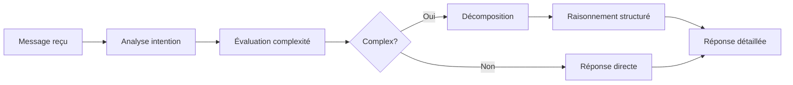

<div align="center">

# 🤖 Bot Discord IA Avancé

**Bot Discord intelligent avec IA locale (Ollama), système de raisonnement avancé et mémoire contextuelle**

[](https://opensource.org/licenses/MIT)
[](https://nodejs.org/)
[](https://discord.js.org/)
[](https://ollama.ai/)

[Installation](#-installation-rapide) • [Configuration](#%EF%B8%8F-configuration) • [Fonctionnalités](#-fonctionnalités) • [Documentation](#-documentation)


</div>

## 📑 Table des Matières

- [À propos](#-à-propos)
- [Fonctionnalités](#-fonctionnalités)
- [Performance selon le matériel](#-performance-selon-le-matériel)
- [Installation rapide](#-installation-rapide)
- [Configuration](#%EF%B8%8F-configuration)
- [Utilisation](#-utilisation)
- [Système de raisonnement](#-système-de-raisonnement-avancé)
- [Scripts disponibles](#-scripts-disponibles)
- [Dépannage](#-dépannage)
- [Contribuer](#-contribuer)
- [License](#-license)

---

## 🎯 À propos

Bot Discord intégrant une **IA locale ultra-performante** avec :
- 🧠 **Raisonnement avancé** : Analyse les intentions et adapte ses réponses
- 💾 **Mémoire intelligente** : Se souvient du contexte et des préférences utilisateur
- ⚡ **Performance optimale** : Configuration automatique selon votre matériel (GPU/CPU)
- 🎭 **Personnalité adaptative** : Ton décontracté, empathique et contextuel

> **Note** : Ce bot utilise [Ollama](https://ollama.ai/) pour faire tourner des modèles IA localement (Mixtral/Mistral), garantissant confidentialité et performance.

---

## ✨ Fonctionnalités

### 🧠 Intelligence Avancée

| Fonctionnalité | Description |
|----------------|-------------|
| **🎯 Détection d'intention** | Analyse le type de question (explication, conseil, problème) et la complexité |
| **🔍 Inférence contextuelle** | Détecte les besoins implicites et l'état émotionnel de l'utilisateur |
| **🧩 Décomposition de problèmes** | Structure le raisonnement en étapes logiques pour les questions complexes |
| **💾 Mémoire illimitée** | Système de mémoire court/long terme avec profils utilisateurs |
| **⚡ Comportement proactif** | Peut initier des conversations et réagir au contexte |

### 💬 Conversation Naturelle

- ✅ Discussions sans restriction (personnalité libérale)
- ✅ Adaptation du ton selon l'émotion détectée
- ✅ Support multi-canal (serveur + DM)
- ✅ Réponses structurées pour questions complexes
- ✅ Apprentissage continu des préférences

---

## 🚀 Performance selon le matériel

Le bot **s'adapte automatiquement** à votre configuration matérielle :

<div align="center">

| 🖥️ Matériel | 🔧 Configuration | 🤖 Modèle | ⚡ Vitesse | 💾 Mémoire |
|-------------|------------------|-----------|-----------|-----------|
| **🎮 RTX 4090/4080S** | GPU CUDA | Mixtral 8x7B | 5-10s | 13 GB VRAM |
| **🎮 RTX 3090/3080 Ti** | GPU CUDA | Mixtral 8x7B | 6-12s | 13 GB VRAM |
| **🎮 RTX 3080 (10GB)** | GPU CUDA | Mistral 7B | 1-3s | 4 GB VRAM |
| **🔴 AMD RX 6000+** | CPU | Mistral 7B | 8-15s | 6 GB RAM |
| **🖥️ CPU seul** | CPU | Mistral 7B | 10-20s | 6 GB RAM |

</div>

> 💡 **Astuce** : Le script `setup-config.ps1` détecte automatiquement votre matériel et configure les paramètres optimaux.

---

## 📦 Installation Rapide

### Prérequis

- [Node.js](https://nodejs.org/) 18.x ou supérieur
- [Ollama](https://ollama.ai/download) installé
- Compte [Discord Developer](https://discord.com/developers/applications)

### Installation

```powershell
# 1. Cloner le projet
git clone https://github.com/votre-username/BotDsC.git
cd BotDsC

# 2. Installer les dépendances
npm install

# 3. Configuration automatique selon votre matériel
.\setup-config.ps1

# 4. Configurer le token Discord
"DISCORD_TOKEN=VOTRE_TOKEN_ICI" | Out-File -Encoding UTF8 .env

# 5. Démarrer le bot
.\start-bot.ps1
```

> ⚠️ **Important** : Ne partagez **JAMAIS** votre token Discord publiquement !

---

## ⚙️ Configuration

### 1. Token Discord

1. Créez une application sur [Discord Developer Portal](https://discord.com/developers/applications)
2. Allez dans **Bot** > **Reset Token** et copiez le token
3. Ajoutez-le dans le fichier `.env` :

```env
DISCORD_TOKEN=votre_token_discord_ici
OLLAMA_MODEL=mixtral
AI_MEMORY_LENGTH=12
```

### 2. Permissions et Intents

**Intents requis** (Developer Portal > Bot) :
- ✅ `MESSAGE CONTENT INTENT`
- ✅ `SERVER MEMBERS INTENT` (optionnel)
- ✅ `PRESENCE INTENT` (optionnel)

**Permissions bot** :
- ✅ Read Messages/View Channels
- ✅ Send Messages
- ✅ Read Message History
- ✅ Add Reactions

**Lien d'invitation** :
```
https://discord.com/api/oauth2/authorize?client_id=VOTRE_CLIENT_ID&permissions=68608&scope=bot
```

### 3. Choix du modèle IA

| Modèle | Qualité | Vitesse GPU | Vitesse CPU | VRAM/RAM |
|--------|---------|-------------|-------------|----------|
| **Mixtral 8x7B** | 🟢🟢 Excellente | 5-10s | 60-90s | 13 GB / 16 GB |
| **Mistral 7B** | 🟢 Très bonne | 1-3s | 8-15s | 4 GB / 6 GB |

```powershell
# Télécharger le modèle
ollama pull mixtral  # ou mistral

# Vérifier que le modèle fonctionne
ollama run mixtral "Bonjour"
```

---

## 🎮 Utilisation

### Interactions avec le bot

Le bot répond à plusieurs types d'interactions :

```
# Mention directe
@BotName Salut, comment ça va ?

# Message privé (DM)
Raconte-moi une blague

# Préfixe (optionnel)
!ask Explique-moi les threads Python
```

### Commandes disponibles

| Commande | Description |
|----------|-------------|
| `!help` / `!aide` | Affiche l'aide complète |
| `!reset` / `!clear` | Efface l'historique de conversation |
| `!mem` | Affiche l'état de la mémoire |
| `!setmem <n>` | Change la profondeur mémoire (4-100) |

### Exemples d'interaction

<details>
<summary>📝 Cliquez pour voir des exemples de conversations</summary>

**Conversation simple :**
```
User: @Bot salut !
Bot:  Salut ! Ça roule ? 😎
```

**Question technique :**
```
User: @Bot explique-moi les threads en Python
Bot:  Les threads en Python permettent d'exécuter plusieurs tâches...
      
      1. Import du module threading
      2. Création d'un Thread
      3. Démarrage avec .start()
      
      [Réponse détaillée avec exemples de code]
```

**Détection d'émotion :**
```
User: @Bot putain ça marche pas ce code !
Bot:  Je comprends ta frustration. Montre-moi ton code, 
      on va trouver le problème ensemble. 🛠️
```

</details>

---

## 🧠 Système de Raisonnement Avancé

Le bot analyse chaque message selon plusieurs dimensions :

### 🎯 Détection d'Intention

```
Type de question → Explication | Conseil | Comparaison | Problème
Complexité       → Simple | Medium | Complex
Besoins          → Explication | Solution | Support émotionnel
État émotionnel  → Frustré | Positif | Confus | Neutre
```

### 🔍 Processus de Raisonnement

<div align="center">



</div>

### 📊 Exemple d'amélioration

| Avant (IA simple) | Après (Raisonnement avancé) |
|-------------------|----------------------------|
| Réponse générique | Analyse du contexte |
| Pas d'adaptation | Détection de l'émotion |
| Réponse unique | Structuration par étapes |
| Oubli du contexte | Mémoire long terme |

📚 **Documentation complète** : [REASONING-SYSTEM.md](./REASONING-SYSTEM.md)

---

## 🛠️ Scripts Disponibles

### PowerShell (Windows)

```powershell
.\start-bot.ps1        # Démarrer le bot
.\stop-bot.ps1         # Arrêter le bot et Ollama
.\check-bot.ps1        # Vérifier l'état du bot
.\monitor-bot.ps1      # Surveiller en temps réel
.\setup-config.ps1     # Auto-configuration matériel
.\kill-all.ps1         # Arrêt d'urgence
```

### NPM Scripts

```bash
npm run bot:start      # Démarrer le bot
npm run bot:stop       # Arrêter le bot
npm run bot:check      # Vérifier l'état
npm run bot:monitor    # Monitoring en temps réel
```

---

## 🔧 Dépannage

<details>
<summary>❌ Le bot ne se connecte pas</summary>

**Causes possibles :**
- Token Discord invalide
- Mauvaise configuration `.env`
- Bot non invité sur le serveur

**Solution :**
```powershell
# Vérifier le fichier .env
Get-Content .env

# Régénérer le token sur Discord Developer Portal
# Remplacer dans .env et redémarrer
.\start-bot.ps1
```
</details>

<details>
<summary>⏱️ Timeout / L'IA ne répond pas</summary>

**Pour GPU NVIDIA :**
```powershell
# Vérifier que le GPU est utilisé
nvidia-smi
ollama ps  # Doit afficher "100% GPU"

# Forcer la configuration GPU
Copy-Item .\configs\ollama-gpu.js .\ollama.js -Force
.\start-bot.ps1
```

**Pour CPU/AMD :**
```powershell
# Passer à Mistral (10x plus rapide)
ollama pull mistral
$env:OLLAMA_MODEL="mistral"
.\start-bot.ps1
```
</details>

<details>
<summary>🐌 Le bot est trop lent</summary>

**Solutions :**
1. Passer à un modèle plus léger (Mistral 7B)
2. Augmenter les timeouts dans `ollama.js`
3. Fermer les applications gourmandes en RAM
4. Vérifier que le GPU est bien utilisé (NVIDIA uniquement)
</details>

<details>
<summary>💾 Out of Memory</summary>

```powershell
# Utiliser Mistral au lieu de Mixtral
ollama pull mistral
# Éditer .env : OLLAMA_MODEL=mistral

# Libérer de la RAM
# Fermer Chrome, jeux, etc.
```
</details>

---

## 📁 Structure du Projet

```
BotDsC/
├── 📄 index.js                      # Point d'entrée principal
├── 🧠 reasoning-engine.js           # Système de raisonnement
├── 🤖 ollama.js                     # Interface Ollama (auto-configuré)
├── 💾 smart-memory.js               # Mémoire intelligente
├── 🎭 proactive-behavior.js         # Comportement proactif
├── 📋 context-manager.js            # Gestion du contexte
│
├── ⚙️ configs/
│   ├── ollama-gpu.js               # Config GPU NVIDIA (30s timeout)
│   └── ollama-cpu.js               # Config CPU/AMD (3min timeout)
│
├── 💾 data/
│   ├── smart-memory.json           # Mémoires utilisateurs
│   ├── reasoning-cache.json        # Cache de raisonnement
│   ├── user-profiles.json          # Profils et préférences
│   └── proactive-config.json       # Config comportement proactif
│
├── 🔧 Scripts PowerShell
│   ├── start-bot.ps1
│   ├── stop-bot.ps1
│   ├── setup-config.ps1
│   └── monitor-bot.ps1
│
└── 📚 Documentation
    ├── README.md
    ├── REASONING-SYSTEM.md
    └── CHOIX-CONFIGURATION.md
```

---

## 🤝 Contribuer

Les contributions sont les bienvenues ! Voici comment participer :

1. 🍴 **Fork** le projet
2. 🌿 Créez une branche (`git checkout -b feature/amelioration`)
3. ✏️ Commit vos changements (`git commit -m 'Ajout feature X'`)
4. 📤 Push vers la branche (`git push origin feature/amelioration`)
5. 🔀 Ouvrez une **Pull Request**

### 📋 Guidelines

- Respecter la structure du code existant
- Tester toutes les fonctionnalités ajoutées
- Documenter les changements majeurs
- Suivre les conventions de nommage

---

## 📜 License

Ce projet est sous licence **MIT**. Voir [LICENSE](LICENSE) pour plus de détails.

```
MIT License - Libre d'utilisation et de modification
```

---

## 🌟 Crédits et Remerciements

- **[Ollama](https://ollama.ai/)** - Plateforme IA locale
- **[Mistral AI](https://mistral.ai/)** - Modèles Mixtral & Mistral 🇫🇷
- **[Discord.js](https://discord.js.org/)** - Bibliothèque Discord
- Communauté open-source pour les contributions

---

<div align="center">

### 🚀 Prêt à démarrer ?

[📥 Télécharger](https://github.com/votre-username/BotDsC/archive/refs/heads/main.zip) • [📖 Documentation](./REASONING-SYSTEM.md) • [💬 Discord](https://discord.gg/votre-invite)


**Fait avec ❤️ par la communauté • Dernière mise à jour : Janvier 2025**

</div>
